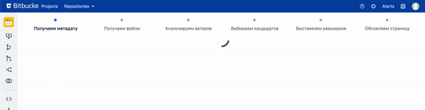

# Swiser

## Анализируем код и обнаруживаем подходящих ревьюеров 🕵🏻‍♂️

Swiser — Это плагин для Bitbucket, который устанавливает нужных ревьюеров в ваш Pull Request.

> Каждый готов помочь, но никто не хочет быть первым. (Пёрл Бейли)

## Принцип работы

Весь алгоритм работы можно разделить на основные этапы

| № | Этап и описание |
| - | --------------- |
| 1 | Обнаруживаем идентификаторы репозитория и пулл реквеста и передаём их на "серверную" часть плагина. |
| 2 | Перехватываем сервлетом данные и выбираем стратегию для обработки. |
| 3 | Обнаруживаем какие файлы были изменены в рамках данного пулл реквеста. |
| 4 | Обнаруживаем людей, которые изменяли эти файлы в прошлом по Git-истории. |
| 5 | Определяем наиболее часто встречаемых людей — именно они и будут нашими кандидатами. |
| 6 | Ищем соответствие людям из Git-истории в Bitbucket-сервисе — чтобы исключить тех людей, которых уже нет. |
| 7 | После того, как мы нашли заданное количество кандидатов для ревью, программно устанавливаем этих людей на ревью данного пулл реквеста. |
| 8 | С анимацией (уж как получилось) показываем результат работы на "клиентской" части плагина. |

## Планы на развитие

| № | Возможность / новая функция |
| - | --------------- |
| 1 | Добавить страницу настроек плагина для конкретного репозитория. |
| 2 | В настройках сделать возможность задания количества ревьюеров. |
| 3 | В настройках сделать возможность задания форсирования/остановки перезапуска поиска (сейчас, если люди не найдены, плагин будет искать их заново). |
| 4 | Реализовать приоритезацию для поиска ревьюеров: учитывать не только Git-историю, но и текущую загруженность людей на Code Review. |
| 5 | В настройках сделать возможность задания обязательных ревьюеров, которые будут устанавливаться независимо от результатов выборов. |
| 6 | Реализовать показ ошибок от плагина через всплывающие окна на странице с пулл реквестом. |

## Dependencies

| Dependency | Link |
| ------ | ------ |
| **Gson** | https://github.com/google/gson |
| **Atlassian Bitbucket JAVA API** | https://docs.atlassian.com/bitbucket-server/javadoc/7.11.2/api/ |

## License

Copyright (c) 2019-2021 Ivan Bukshev
